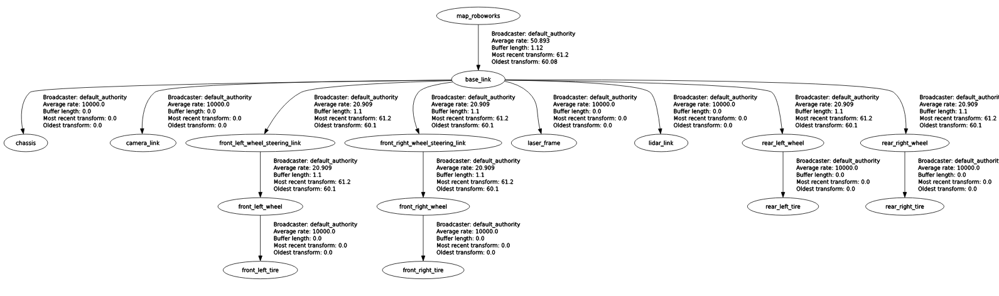

# robotverseny

[](https://docs.ros.org/en/humble/)


## Clone 

``` bash
cd ~/ros2_ws/src
```

``` bash
git clone https://github.com/robotverseny/robotverseny_gazebo24
```

## Build

``` bash
cd ~/ros2_ws
```

``` bash
colcon build --symlink-install --packages-select robotverseny_application robotverseny_description robotverseny_bringup robotverseny_gazebo 
```

## Run

<details>
<summary> Don't forget to source before ROS commands.</summary>

``` bash
source ~/ros2_ws/install/setup.bash
```
</details>

``` bash
ros2 launch robotverseny_bringup roboworks.launch.py
```

or without rviz:

``` bash
ros2 launch robotverseny_bringup roboworks.launch.py rviz:=false
```
> [!TIP]
> ## Rviz 2d overlay

>``` r
>sudo apt install ros-humble-rviz-2d-overlay*
>```

> [!WARNING]  
> The command `export IGN_GAZEBO_RESOURCE_PATH=` or `export IGN_GAZEBO_MODEL_PATH=` will delete your previous paths.

## Gazebo related

> [!TIP]
> Gazebo Fortress: [gazebosim.org/docs/fortress/install_ubuntu](https://gazebosim.org/docs/fortress/install_ubuntu), read more about integration: [gazebosim.org/docs/fortress/ros2_integration](https://gazebosim.org/docs/fortress/ros2_integration)
> `ros-gz-bridge` install with a single command: `sudo apt install ros-humble-ros-gz-bridge`


Publish command topic:
``` bash
ros2 topic pub --once /cmd_vel geometry_msgs/msg/Twist "{linear: {x: 2.5, y: 0.0, z: 0.0}, angular: {x: 0.0, y: 0.0, z: -0.01}}"
```

Teleop twist keyboard:
``` bash
ros2 run teleop_twist_keyboard teleop_twist_keyboard --ros-args -r /cmd_vel:=/cmd_vel
```
    
Ignition info topic:
``` bash
ign topic -i --topic /model/roboworks/cmd_vel
```
Ignition echo topic:

``` bash
ign topic -et /model/roboworks/cmd_vel
```

Topics:

``` bash
ros2 topic list

/clicked_point
/clock
/debug_marker
/debug_marker_left
/debug_marker_left_array
/debug_marker_right
/debug_marker_right_array
/goal_pose
/initialpose
/joint_states
/marker_path
/parameter_events
/robot_description
/roboworks/cmd_vel
/roboworks/odometry
/roboworks/scan
/steer_marker
/steer_marker_array
/rosout
/tf
/tf_static
```

## TF Tree



